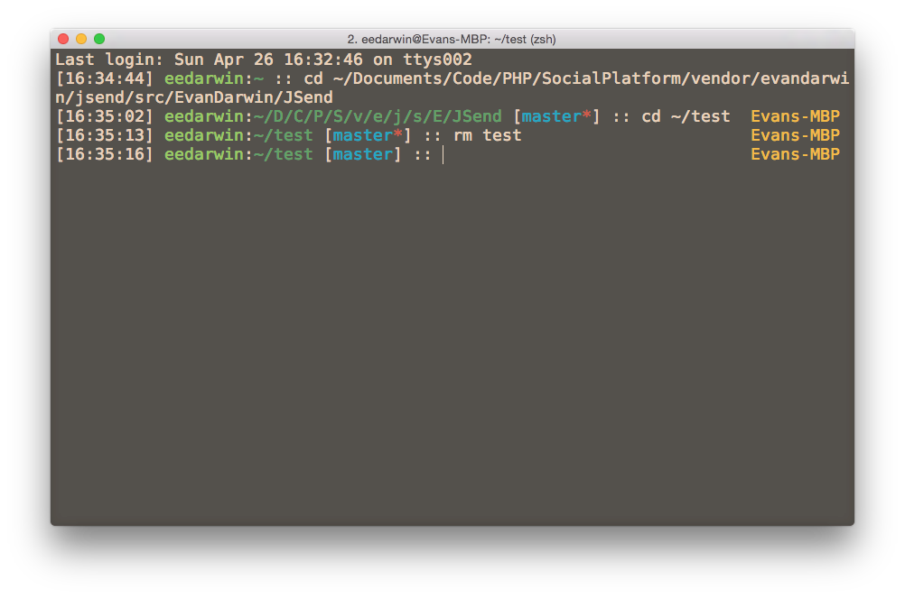

# evan2 - Oh-my-zsh theme



## Installation

```sh
mkdir -p ~/.oh-my-zsh/custom/themes/
git clone https://github.com/EvanDarwin/evan2.git ~/.oh-my-zsh/custom/themes/evan2
# Link it to the themes/ folder
ln -s ~/.oh-my-zsh/custom/themes/evan2/evan2.zsh-theme ~/.oh-my-zsh/themes/
```

And then update the `ZSH_THEME` variable in your `~/.zshrc` to **evan2**.
